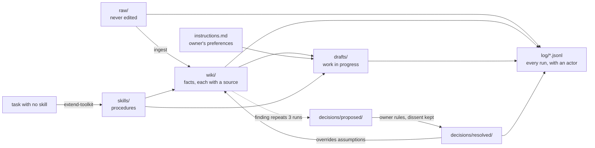

# brain-starter

**A filing cabinet, a rulebook and a way to grow its own tools: the house your AI second brain lives in.**

[](LICENSE)
[](CHANGELOG.md)


## The story

I hired the best person in the world for my job. On day one they knew nothing about my business, and by tomorrow they had forgotten today. So I stopped looking for a smarter AI and built it a memory that earns what it believes.

The first version was fast and useless. I would hand it a call transcript and it would file a page in seconds, in a different folder from yesterday's, with a claim I could not trace and a "fact" it had guessed. Speed is useless if the filing cabinet is chaos. The real work turned out to be how the cabinet is organised before anyone asks: what goes where, what may never be touched, which document wins an argument, and who is allowed to change the rules.

Before: a smart stranger every morning. After: a librarian who reads the rulebook first, files everything with its source, logs every move, and writes itself a new procedure when it meets a job it cannot do.

Most AI setups forget. This one compounds.

## 60-second quickstart

**Claude Code**

```
git clone https://github.com/itstauf/brain-starter my-brain
cd my-brain
claude
```

Then paste prompt A from `first-prompt.md`. The agent interviews you and fills in the `<PLACEHOLDERS>` in `CLAUDE.md` and `instructions.md`. Drop one real file into `raw/` (a transcript, call notes, an article; date it, do not clean it) and say "ingest". Watch the structure earn its place.

Starting from an empty folder instead? Paste prompt B from `first-prompt.md` and the agent builds the same constitution itself. Compare what it wrote with `CLAUDE.md` here and steal any rule yours is missing. It is your constitution. Not its.

Raw is sacred. The brain is alive.

## How it works



Four ideas carry the whole thing:

1. **Three memories, three rules.** Facts (`raw/`, `wiki/`, `decisions/resolved/`) are read-only to every task except their one named writer. Preferences (`instructions.md`) change only from the owner's own words. Procedures (`skills/`) are authored, never improvised. See `docs/the-three-memories.md`.
2. **Which document wins.** `CLAUDE.md` holds an explicit authority order, so when two files disagree the agent knows which one to believe, and an explicit decision always beats an assumption.
3. **Log every run.** One JSON line per skill run in `log/runs.jsonl`, always with an `actor`. If it was not logged, it did not happen.
4. **The fixed point.** If a task cannot be done well with current skills, the agent stops and runs `skills/extend-toolkit.md` to write the missing skill. The brain grows its own tools in response to real use.

The markdown wiki itself is common, and I credit it below. What this series ships that others do not: how the system decides what is true, how it polices its own output, and how it grows its own tools.

| Path | What it is |
|---|---|
| `CLAUDE.md` | The constitution template |
| `instructions.md` | The preferences template |
| `raw/`, `wiki/` | Sources and the brain built from them |
| `skills/` | `_schema.md`, `extend-toolkit`, `ingest`, `lint-brain`, and a catalogue |
| `log/` | `runs.jsonl`, `decisions.jsonl`, `feedback.jsonl`, schemas in `log/README.md` |
| `decisions/` | `proposed/`, `resolved/`, and `_template.md` |
| `drafts/` | Work in progress |
| `docs/` | The why, and how to run it with a team |
| `examples/` | A real ingest run and a resolved decision, on synthetic data |

### Add a room

This repo is the house. Four optional rooms plug into it, or into any other house: [learning-glossary](https://github.com/itstauf/learning-glossary), [evidence-ladder](https://github.com/itstauf/evidence-ladder), [the-critic](https://github.com/itstauf/the-critic) and [brain-map](https://github.com/itstauf/brain-map). How to add each one: `docs/plug-in-a-room.md`.

## Use it your way

### Claude Code

Clone the repo, or copy `CLAUDE.md`, `instructions.md`, `skills/` and `.claude/skills/` into an existing folder. The wrappers in `.claude/skills/` make `ingest`, `lint-brain` and `extend-toolkit` available by name; each one points at the real procedure in `skills/` so there is one source of truth.

### Claude.ai Projects or ChatGPT Projects

Paste `prompts/project-instructions.md` into the project's instructions. Upload `CLAUDE.md`, `instructions.md`, the files in `skills/` and `decisions/_template.md` as project knowledge. The chat cannot write files, so it drafts and you save. Everything else holds.

### Cursor, Codex, or any agent that reads AGENTS.md

`AGENTS.md` points the agent at `CLAUDE.md` and the skills. One constitution for every agent.

### No agent

Read it as a method. `examples/ingest-run/` shows one run before and after; `examples/decision-memo-example.md` shows a decision with dissent kept. Two folders, a notebook and the rules in `CLAUDE.md` are the whole system.

### Running it with a team

One brain, many doors. Most people read and act; few may write. Protect `main`, route changes to `CLAUDE.md`, `skills/` and `decisions/resolved/` through a CODEOWNERS file, and let agents open pull requests but never merge them. The full pattern, with a CODEOWNERS example, is in `docs/running-with-a-team.md`.

## What it will not do / honest limits

- **It is not an app.** No install script, no server, no UI. It is files and rules. The agent does the work.
- **No search index.** The agent reads `wiki/index.md` and searches files. Fine into the hundreds of pages; slow at many thousands.
- **Rules, not locks.** Nothing physically stops someone editing `raw/`. Git history shows it; branch protection and `lint-brain` catch some of it after the fact.
- **Coarse permissions.** Git cannot hide one page from one reader. Groups that must stay apart need separate brains.
- **No live state.** Queues, counters and dashboards belong in the tools built for them. Bring summaries into `raw/`.
- **It needs you.** The owner decides, approves skills and gives feedback. A brain nobody corrects learns nothing.

More in `docs/why-plain-files.md`.

## FAQ

**Do I need Claude Code?**
No. It is the smoothest path because it can read and write the files directly. Chat projects, Cursor, Codex and plain reading all work; see "Use it your way".

**I already use Obsidian. Do I have to move?**
No. Point the agent at your vault, add `CLAUDE.md`, `instructions.md`, `skills/` and `log/`, and keep your notes where they are. Put new source material in a `raw/` folder from now on.

**Why not create the wiki folders up front?**
Because your material knows better than you do on day one. Empty folders become places things go to be forgotten. `ingest` creates a folder when the material needs one and tells you why.

**What does the agent actually log?**
One line per skill run: when, who (`actor`), which skill, what went in, what came out, and what it decided. Schemas and examples are in `log/README.md`.

**What happens when the agent cannot do something?**
It stops and runs `extend-toolkit`, which drafts a new skill, tests it once, logs it and leaves it for you to approve. You stay the author of record.

**Is this what you run yourself?**
Yes, in a larger form: my own practice and one paid engagement, under NDA. This repo is the general shape with everything private removed.

## Credits

- The compiled markdown wiki (raw sources in, an LLM-maintained wiki out): **Andrej Karpathy**, the LLM wiki pattern.
- The legibility rule, log every run: **Tom**, YC Root Access, video 01, "the self-improving company".
- The three-memory model and the self-extending agent (`extend-toolkit`): **Answer This**, YC Root Access, video 04.

## Part of The Compounding Brain

A series by Taufiq uz Zaman. This repo is the filing cabinet and the skills that write skills.

- Guide chapter: [The filing cabinet](https://itstauf.com/resources/second-brain/filing-cabinet?utm_source=github&utm_medium=readme&utm_campaign=compounding-brain&utm_content=brain-starter)
- Guide chapter: [Skills that write skills](https://itstauf.com/resources/second-brain/skills?utm_source=github&utm_medium=readme&utm_campaign=compounding-brain&utm_content=brain-starter)
- The whole guide: [itstauf.com/resources/second-brain](https://itstauf.com/resources/second-brain?utm_source=github&utm_medium=readme&utm_campaign=compounding-brain&utm_content=brain-starter)
- The other rooms: [learning-glossary](https://github.com/itstauf/learning-glossary) · [evidence-ladder](https://github.com/itstauf/evidence-ladder) · [the-critic](https://github.com/itstauf/the-critic) · [brain-map](https://github.com/itstauf/brain-map)
- Build with others: [Brain Builders](https://itstauf.com/resources/second-brain?utm_source=github&utm_medium=readme&utm_campaign=compounding-brain&utm_content=brain-starter#brain-builders)

MIT licensed. Copyright 2026 Taufiq uz Zaman.
